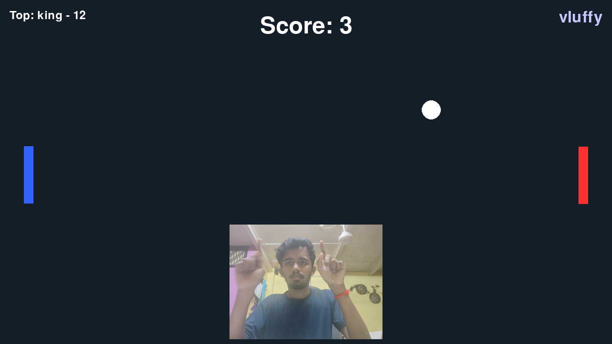

# Single Player Pong with Hand Gesture Control

## 📸 Screenshot

## 🎮 Gameplay Video

<video width="640" controls>
  <source src="demo.mp4" type="video/mp4">
  Your browser does not support the video tag.
</video>

## Overview

This is a Python-based Pong game controlled using hand gestures captured via webcam using MediaPipe and OpenCV. The game uses Pygame for graphics and sound, and supports:

- Real-time paddle control via both hands.
- Realistic ball physics with angle reflection.
- Pause/resume functionality.
- Save screenshots.
- Record gameplay video.
- Score tracking with persistent top score saved in JSON.
- Sound effects for paddle hits, walls, scoring, and game over.

---

## How It Works

1. The webcam captures the player's hands using MediaPipe's hand tracking.
2. The left and right hands control the left and right paddles respectively by tracking wrist vertical positions.
3. The ball moves across the screen, bouncing off paddles and screen edges with realistic physics.
4. The game keeps score and tracks the top score persistently.
5. Players can pause/resume the game, save screenshots, and record gameplay.
6. Sounds are played on collisions and events to enhance the experience.

---

## How to Run
1.run the python file 
2.if you are running it using some exteral webcam setting , make sure you have connected 
| Key | Action                       |
| --- | ---------------------------- |
| `P` | Pause / Resume               |
| `S` | Save screenshot              |
| `V` | Start/Stop gameplay video    |
| `R` | Restart game after game over |
| `Q` | Quit game                    |

### Requirements

- Python 3.8 or higher
- Libraries: `pygame`, `opencv-python`, `mediapipe`, `numpy`,`os`,`json`,`sys`

